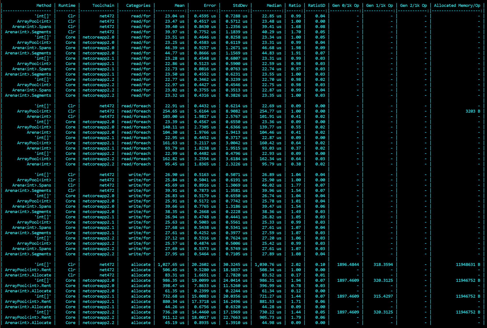

# Arena Allocation

## What is an arena allocator?

An [arena allocator is a mechanism for allocating memory](https://en.wikipedia.org/wiki/Region-based_memory_management) as successive chunks from one or more segments owned by the allocator. In particular, it is useful when allocating lots of array-like blocks during batch processing, and at the end of the batch **nothing survives**:

- allocation becomes very cheap because we're just taking successive slivers from large slabs
- collection becomes *free*: since nothing outlives the batch, we just set our eyes back to the start

For the purposes of this API, I'm talking about arena allocators specifically in the context of allocating array-like structures (think `T[]`, `ArrayPool<T>`, etc).

You can think of it as "stadium seating":

- "hi, I need 92 seats" - "sure, take all of stand A (50 seats), and the first 42 seats from stand B"
- ...
- "hi, I need 14 seats" - "sure, take the next 14 seats in stand C"
- "hi, I need 8 seats" - "hmm, there's only 3 left in stand C; take 3 from stand C and the first five 5 from stand D"
- ...
- "ok, we're about to start a new event" - "OK, everyone's seat is now invalid... just don't use them, thanks; I'm going to start handing out seats at the start of stand A"

By comparison:

- regular array allocation (`new T[size]`) uses the regular allocator, and creates objects (arrays) that the runtime expects *could* outlive the batch (it has no concept of a batch); this means that the garbage collector (GC) needs to track all of those arrays and check when they become unreachable, before reclaiming the underlying memory
- `ArrayPool<T>` allocation allows you to avoid some of this constant churn by claiming arrays from a pool, and returning them to the pool when complete; this avoids some of the GC overhead, but the pool itself has not inconsiderable overhead; additionally:
  - the arrays you get can be scattered *all over memory* (reducing memory locality performance)
  - the arrays you get can be *oversized*, so you need to track the *actual* length in addition to the array
  - you need to add code to manually *return* all of the rented arrays to the pool at the end of the batch - which gets expensive for complex graphs

Arena allocation avoids the downsides of simple or pooled array allocation:

- allocations become very cheap and simple
- allocations typically come from neighbouring memory areas, maximizing memory locality
- collection becomes very cheap
- but: we might need to consider "non-contiguous memory" (e.g. "take 3 from stand C and the first five 5 from stand D")

The last point sounds like an inconvenience, but if you're touching "pipelines", you're probably already familiar with `ReadOnlySequence<T>`, which is **exactly** this scenario, expressed in read-only terms; so we can use this familiar concept, but in a read/write model.

## Introducing `Arena<T>`

To help solve this, we add `Arena<T>`, an arena allocator for blocks of memory of type `T` - broadly comparable to `T[]`/`ArraySegment<T>`/`Memory<T>`.

Usage is simple:

``` c#
using(var arena = new Arena<SomeType>()) // note: options available on .ctor
{
    while (haveWorkToDo) // typically you'll be processing multiple batches
    {
        // ... blah blah lots of work ...

        foreach (var row in something)
        {
            // get a chunk of memory
            var block = arena.Allocate(42);
            // ...
            var anotherBlock = arena.Allocate(itemCount);
            // ...
        }
        
        
        // ... more work ...

        // END OF THIS BATCH - we're going to invalidate all the
        // allocations that we constructed during this batch, and
        // start again
        arena.Reset();
    } 
}
```

In the above, `block` and `anotherBlock` are `Allocation<SomeType>` values; these are the write-friendly cousins of `ReadOnlySequence<SomeType>` with all the features you'd expect - `.Length`, `.Slice(...)`, access to the internal data, etc. Importantly, an `Allocation<T>` is a `readonly struct` value-types (meaning: zero allocations). As with `ReadOnlySequence<T>`, using them is complicated slightly by the fact that it *may* (sometimes) involve non-contiguous memory, so just like with `ReadOnlySequence<T>`, *typically* you'd want to check `.IsSingleSegment` and access `.FirstSpan` (`Span<T>`) or `.FirstSegment` (`Memory<T>`) for an optimized simple fast path, falling back to multi-segment processing otherwise.

## How to work with the values in an allocation

Similarly to `ReadOnlySequence<T>` there is no *indexer* access to the entire block, but you can iterate over the individual segments (`Memory<T>`) if needed. You can also iterate over the spans (`Span<T>`) or even the individual elements (`T`):

``` c#
foreach (Memory<T> segment in block.Segments) { ... }
foreach (Span<T> span in block.Spans) { ... }
foreach (T value in block) { ... }
```

Note that because the segments and spans here are writable rather than read-only, assigning values is as simple as writing to the span indexers.

The most common pattern - and the most efficient - is to iterate over a span via the indexer, so a *very* common usage might be:

``` c#
static decimal SumOrderValue(Allocation<Order> orders)
{
    static decimal Sum(Span<Order> span)
    {
        decimal total = 0;
        for(int i = 0 ; i < span.Length ; i++)
            total += span[i].NetValue;
        return total;
    }

    if (orders.IsSingleSegment) return Sum(orders.FirstSpan);
    decimal total = 0;
    foreach (var span in orders.Spans)
        total += Sum(span);
    }
    return total;
}
```

Or we could write it *more conviently* (but less efficiently) as:

``` c#
static decimal SumOrderValue(Allocation<Order> orders)
{
    decimal total = 0;
    foreach(var order in orders)
        total += order.NetValue;
    return total;    
}
```

However, we can *also* make use of the value iterator in some interesing ways - more than just `foreach`. In particular:

- `.MoveNext()` behaves as you would expect, returning `false` at the end of the data
- `.Current` on the iterator allows both read and write, assigning directly into the data
- `.CurrentReference` on the iterator returns a *reference* to the current element (`ref return`), allowing you to avoid copying large `struct` items unnecessarily, and/or using the item with `in` or `ref` parameters very efficiently
- `.GetNext()` **asserts** that there is more data, and then returns a reference (`ref return`) to the next element (essentially combining `MoveNext()` and `CurrentReference` into a single step)

If the mention of `ref return` references sounds scary: it really isn't; ultimately this is identical to what the array (`T[]`) and span (`Span<T>`) indexers already return; in most cases you simply don't need to stress about it.

One particular interesting scenario that presents itself here is when the `T` is itself a large struct; with *regular* `foreach`, the iterator value (via `.Current`) is a `T`, which can force the large struct to be copied on the stack. We can avoid this problem using `.CurrentReference`, for example:

``` c#
static decimal SumOrderValue(Allocation<Order> orders)
{
    decimal total = 0;
    var iter = orders.GetEnumerator();
    while (iter.MoveNext())
        total += iter.CurrentReference.NetValue;
    return total;
}
```

The `iter.CurrentReference.NetValue` here is a highly efficient way of accessing the value *directly in the underlying memory*, without ever copying the `Order` itself. It *looks* identical, but the impact here can be significant (for large `T`).

Note that not only can you *read* data in this way (without copying), but you can similarly *assign* data directly into the underlying memory (overwriting the value) - simply by *assigning* to `.CurrentReference`. This is, once again, semantically identical to assigning to an array (`T[]`) or span (`Span<T>`) via the indexer.

The `GetNext()` option works similarly, and is particularly useful for migrating existing code; consider:

``` c#
int[] values = new int[itemCount];
int offset = 0;
foreach (var item in ...)
    values[offset++] = item.Something();
return values;
```

We can migrate this conveniently to:

``` c#
var values = arena.Allocate(itemCount);
var iter = values.GetEnumerator();
foreach (var item in ...)
    iter.GetNext() = item.Something();
return values;
```

(of course we *could* also choose to check `values.IsSingleSegment` and optimize for the single-segment variant, which is usually **very common**, but ... we don't *have* to).

## Conversion to `ReadOnlySequence<T>`

Because the `Allocation<T>` concept is so close to `ReadOnlySequence<T>`, you may want to get the read-only version of the memory; fortunatly, this is simple:

``` c#
Allocation<T> block = ...
ReadOnlySequence<T> readOnly = block.AsReadOnly();
```

or even via the implicit operator:

```
Allocation<T> block = ...
ReadOnlySequence<T> readOnly = block;
```

You can even *convert back again* - but **only** from sequences that were obtained from an `Allocation<T>` in the first place:

``` c#
ReadOnlySequence<T> readOnly = ...
if (Allocation<T>.TryGetAllocation(readOnly, out ReadOnlySequence<T> block))
{
    ...
}
```

(or via the `explicit` conversion operator, which will `throw` for invalid sequences)


## Recursive structs

A common pattern in data parsing is the [DOM](https://en.wikipedia.org/wiki/Document_Object_Model), and in a low-allocation parser you might want to create a `struct`-based DOM, i.e.

``` c#
readonly struct Node {
    // not shown: some other state
    public Allocation<Node> Children { get; }
    public Node(/* other state */, Allocation<Node> children)
    {
        // not shown: assign other state
        Children = children;
    }
}
```

The above is trivially possible with arrays (`T[]`), but the above declaration is actually invalid; the CLR assumes that `Allocation<T>` could feasibly contain a field of type `T` (now, or in the future), and if it did, a `struct` would indirectly contain itself. This makes it impossible to determine the size of the `struct`, and the CLR refuses to accept the type. It works with naked arrays because the runtime knows that an array is a regular reference, but the above would also fail for `Memory<Node>`, `ReadOnlySequence<Node>`, `ArraySegment<Node>` etc.

Because this type of scenario is desirable, we add an additional concept to help us with this use-case: *untyped allocations*. Actually, they aren't really untyped - it is all just a trick to make the runtime happy, but - the following works perfectly and remains zero-allocation:

``` c#
readonly struct Node {
    // not shown: some other state
    private readonly Allocation _children; // note no <T> here
    public Allocation<Node> Children => _children.Cast<Node>();
    public Node(/* other state */, Allocation<Node> children)
    {
        // not shown: assign other state
        _children = children.Untyped();
    }
}
```

(conversion operators are provided for convenience, too - `implicit` for the `Untyped()` step and `explicit` for the `Cast<T>()` step)

## Configuration

A number of configuration options are provided in the `Arena<T>` constructor:

- `allocator` - the underlying source of data; in terms of our "stadium" example, this is used whenever the arena finds that it doesn't have enough seats, to construct a new stand
  - by default, an allocator based on `ArrayPool<T>.Shared` is used - taking arrays when needed, and returning them when not
  - you can create allocators based on custom `ArrayPool<T>` instances
  - if you prefer, `UnmanagedAllocator<T>.Shared` can be used for any `T : unmanaged`, which uses `Marshal.AllocHGlobal` and `Marshal.FreeHGlobal`
  - or you can provide your own custom allocator if you want to do something more exotic
- `options` - a set of flags that impact overall behaviour:
  - `ArenaOptions.ClearAtReset` ensures that memory is wiped (to zero) before handing it to consumers via `Allocate()`; for performance, rather than wipe per allocation, the entire allocated region is wiped when `Reset()` is called, or whenever a new block is allocated
  - `ArenaOptions.ClearAtDispose` ensures that memory is wiped (to zero) before the underlying allocator returns it to wherever it came from; this prevents your data from become accessible to arbitrary consumers (for example via `ArrayPool<T>` when using the default configuration) and is *broadly* comparable to the `ArrayPool<T>.Return(array, clearArray: true)` option; note that this option can not prevent direct memory access from seeing your data while in use (nothing can)
- `blockSize` - the amount (in elements of `T`) to request from the underlying allocator when a new block is required; note that the allocator uses this for guidance only and could allocate different amounts. The default option is to allocate blocks of 128KiB - this ensures low fragmentation and (for the default array-based allocator) means that the backing arrays are on the Large Object Heap; a large block size also means that virtually all allocations are single-segment rather than multi-segment
- `retentionPolicy` - **not currently implemented** - provides a mechanism for determining when to *release* memory at the end of each batches; it is normal for the amount of memory to fluctuate between batches, so it usually isn't desirable to release everything each time; the default policy is to use an exponential decay of 90% - meaning: each time we `Reset()`, if we had used less memory than before, we'll drop the amount to retain to 90% of what it was previously (if we used *more*, it'll jump up to the new amount immediately). This means that we don't *immediately* release untouched blocks, but if we *consistently* find ourselves using much less than we previously have, we will *eventually* release blocks. Other common policies (`Recent`, `Nothing`, `Everything`, etc) are available under `RetentionPolicy` - or you can provide your own custom retention policy as a function of the previously retained amount, and the amount used in the current batch (`Func<long,long,long>`)

## Performance

Performance is shown in the image below; a short summary would be:

- allocations are about 25 times faster than `new T[]` arrays (presumably mostly due to GC overheads), and about 10-15 times faster than `ArrayPool<T>` (presumably due to the more complex work required by an array-pool)
- read and write when using optimized `for` loops using the span indexers are, on .NET Core, idential to using similar `for` loops using arrays; on .NET Framework (which has a different `Span<T>` implementation and may lack bounds-check elision), performance is degraded to half that of raw arrays (this is endemic to `Span<T>` generally, and is not specific to `Arena<T>`)
- read when using element-based `foreach` loops is degraded to a quarter of the performance when compared to arrays; for a comparison/baseline, when using `ArraySegment<T>` (a convenient way of representing `ArrayPool<T>` leases, due to the fact that leased arrays are oversized), this is actually very good, with `ArraySegment<T>` being *twice as slow* as the `Allocation<T>` implementation of simple `foreach`

So: on .NET Core in particular, there is *zero loss* (especially if you're using optimized span-based access), and **lots of win** in allocation. On .NET Framework, there is *some loss* (an *extremely* fast number becomes a *very* fast number when using span-based access), and still **lots of win** in allocation. Use of `foreach` is *perfecty acceptable* (but not as fast as span-based access) - especially for non-critical code-paths.



## Other questions

### What about thread-safety?

An `Arena<T>` is not thread-safe; normally, it is assumed that an individual batch will only be processed by a single thread, so we don't attempt to make it thread-safe. If you have a batch-processing scenario where you *can* process the data in parallel: that's fine, but you will need to add some kind of synchrnoization (usually via `lock`) around the calls to `Allocate()` and `Reset()`. Note that two *separate* concurrent batches should not usually use the same `Arena<T>`, unless you are happy that `Reset()` applies to both of them.

### What if I keep hold of an allocation?

If your code chooses to leak an `Allocation<T>` outside of a batch (more specifically: past a `Reset()` call, or past the arena's final `Dispose()` call), then: **that's on you**. What happens next is undefined, but commonly:

- you could be stomping over data that is still in the arena; it may or may not have been wiped (depending on the configuration), and may or may not have been handed to new allocations in later batches
- the data may have been released from the arena back to the allocator; if you're using the default `ArrayPool<T>` allocator, then this is similar to holding onto an array after calling `ArrayPool<T>.Return(...)`; if you're using an unmanaged allocater, this could immediately give you an access violation ... or you could just end up overwriting arbitrary memory now in use for other purposes inside your application

Basically: **just don't do it**. Part of choosing to use an `Arena<T>` is making the determination that **you know the lifetime of your data**, and are therefore choosing not to do silly things. The risks here are mostly comparable to identical concerns when using `ArrayPool<T>`, so this is a perfectly reasonable and acceptable compromise.

### Naming is hard (?)

With the existing area being `ReadOnlySequence<T>`, it is very tempting to call the writable version `Sequence<T>`. But that also feels like an ambiguous name, with `Allocation<T>` being more specific. I could be open to persuasion here...

### How can I play with it?

Right now, it is available in the "unlisted" nuget drop, [1.0.37](https://www.nuget.org/packages/Pipelines.Sockets.Unofficial/1.0.37). Have fun!

### Could I create something like `List<T>` on top of it?

Absolutely! It *probably* makes sense for any such type to be a `class` rather than a `struct`, though, since a lot of list access is done via interfaces, which *usually* involves boxing (since not many people write APIs that take things like `<TList, ITtem> where TList : IList<TItem>`, which is what you'd need for "constrained" access without boxing).

Considerations:

- indexer access might be expensive, and the current `Allocation<T>.Enumerator` is a `ref struct`, meaning you can't store it as a field (in the hope that most indexer access is actually incremental); we could perhaps add some API to help with this, perhaps based on `SequencePosition`?
- you can't resize an `Allocation<T>` (but then... you can't resize a `T[]` either)
- most other common API surfaces should be easy to add, though